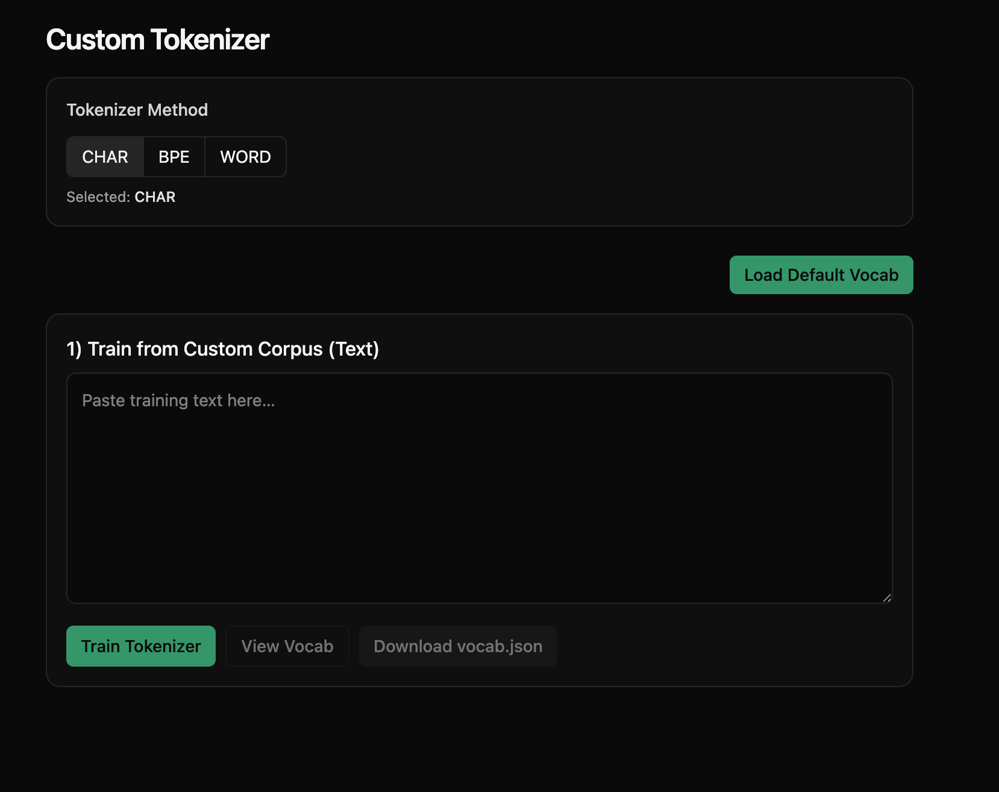
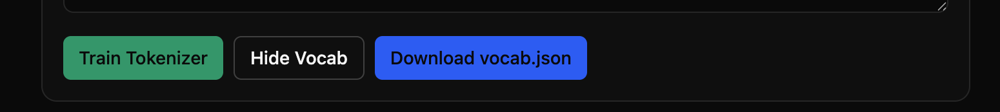
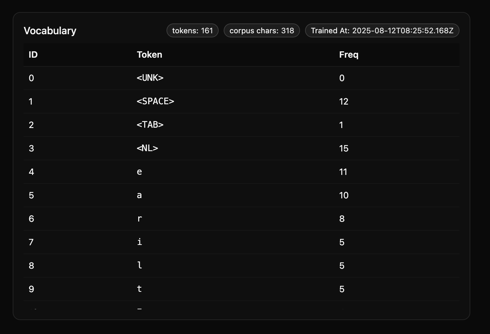
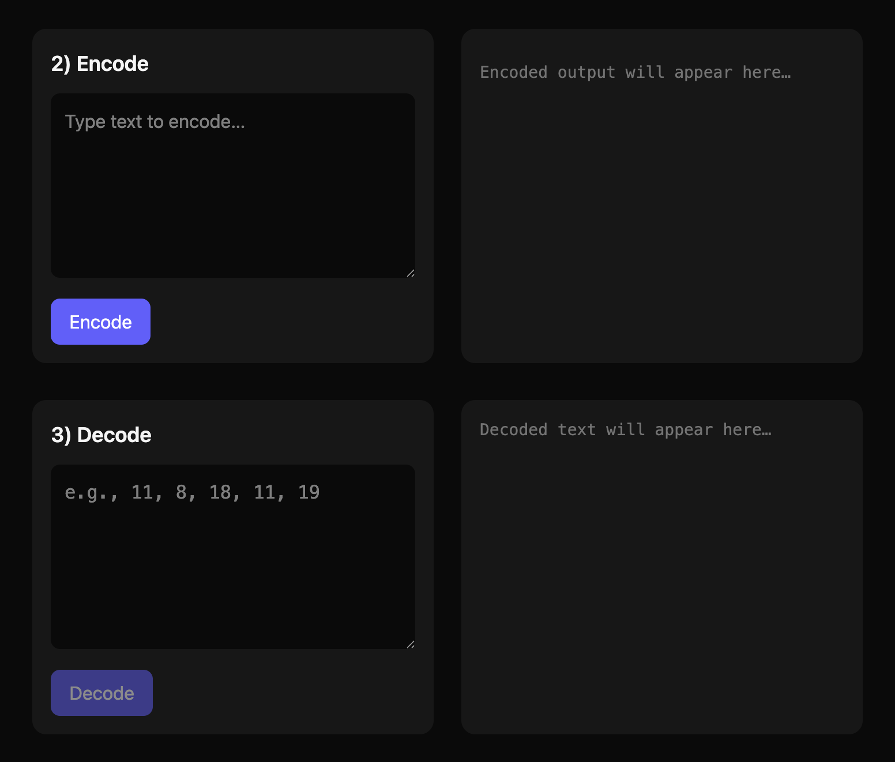
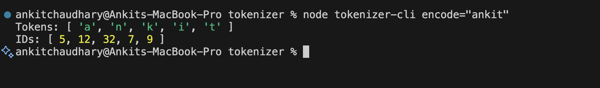
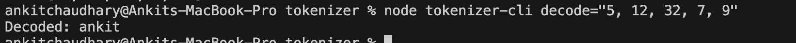

# 🔡 Basic Character-Level Tokenizer


## 📖 Introduction  
This project is a **simple character-level tokenizer** designed to demonstrate how text can be split into smaller units (tokens) and mapped to unique IDs.  

It includes both:  
- A **web-based interface** for interactive exploration  
- A **CLI tool** for quick testing of encode/decode with pretrained vocab  

The **pre-trained vocabulary** is stored in `public/vocab.js`.  

While this is a **basic implementation**, real-world LLMs (Large Language Models) often use **Byte Pair Encoding (BPE)** or other advanced methods for better efficiency. *(BPE support may be added in the future.)*

---

## 🛠 Tech Stack  
- **Next.js** — React-based web framework
- **Tailwind CSS** — UI styling
- **JavaScript**
- **Node.js** — CLI support
- **Character-based tokenizer** implementation


---

## 🚀 Getting Started  

```bash
# 1️⃣ Clone the repository
git clone <repo-url>
cd <repo-folder>

# 2️⃣ Install dependencies (if required)
npm install

# 3️⃣ Launch the web interface
npm run dev


## 🌐 Using the Web Application  

### 1️⃣ Select Tokenizer Method  
- Currently, only **CHAR** mode is supported.  

### 2️⃣ Provide Input  
- Either type your own text or load the **default vocabulary**.  

### 3️⃣ View Vocabulary  
- Displays each character’s:
  - **Mapping**  
  - **Frequency**  
  - **Timestamps**  
  - Other details  



### 4️⃣ Encode Text  
- Enter text → returns **tokens** and **IDs**.  
- Characters not found in the vocabulary return **`<UNK>`**.  

### 5️⃣ Decode IDs  
- Enter IDs to get the original text back.  



### 6️⃣ Copy & Paste IDs  
- Click **"Copy IDs"** → paste into the **Decode Panel**.  


## 🖥 Using the CLI Tool  

The CLI tool don't allows you to train the tokenizer with **custom data** user web for that, Cli only supports run **encode/decode** operations.  

```bash
# Encode text into tokens/IDs
node tokenizer-cli encode="your text"



# Decode IDs back to text
node tokenizer-cli decode="0,1,2"


